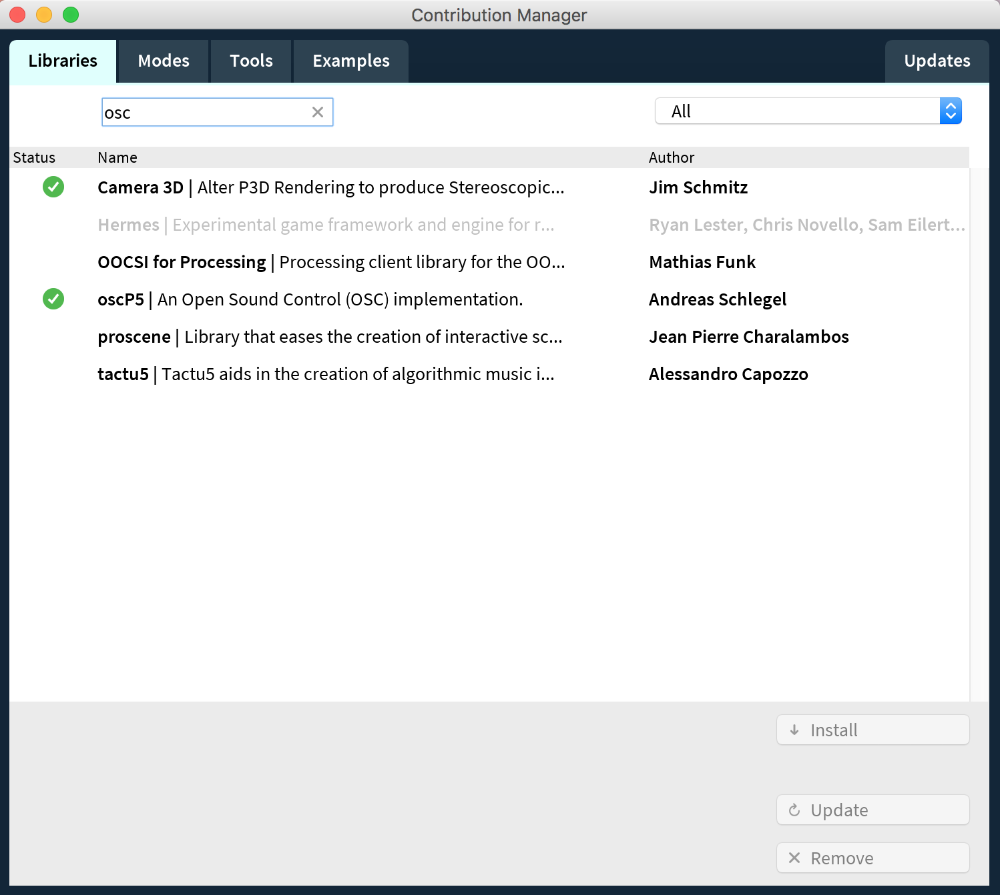

# Paint with Processing and TouchOSC
#### Workshop June 2017


_Note: Show screen with QuickTime, New Movie Recording, and a Connected iOS Device._

In this workshop we will be learning how to connect your Processing sketches to TouchOSC iPad app, create custom TouchOSC interfaces, so that you can control multiple parameters in your Processing sketches. Familiarity with processing will definitely help, but isn't necessary.

We will spend 2 hours reviewing setup, and the 3rd hour will be dedicated to working on your sketches and answering questions.

#### Resources

[Download TouchOSC](https://itunes.apple.com/app/touchosc/id288120394)

[Download TouchOSC Editor](https://hexler.net/software/touchosc#downloads)

[Download TouchOSC Bridge](https://hexler.net/software/touchosc#downloads)

[Download Processing](https://processing.org/download/)


## Intro Sketch
Here we can see a quick video that will allow us to get an idea of the type of interaction we can add by connecting controllers beyond the mouse. Once we go beyond the mouse, interacting with the computer becomes almost like a musical experience.

[Example link 1](https://vimeo.com/59984923)

[Example link 2](https://vimeo.com/2388650)

[Example link 3](https://vimeo.com/37936808)


## What is TouchOSC?
TouchOSC is an app designed for iOS that gives us the ability to communicate between platforms using Open Sound Control(OSC) protocol and Midi. It also gives us the ability to connect to our computer remotely so that it is not the main center of focus.


## TouchOSC Editor
In the TouchOSC Editor, we can create a customized interface with multiple pages and input types that gives us multiple ways to control behaviors in our sketches.

####Demo:
- Designing using basic inputs
- Moving over to Processing to check connectivity in OSC or MIDI
- Using value to assign a control point


## Getting started
TouchOSC communicated via Midi and OSC. OSC requires a Wifi connection and Port setup in order to receive a signal. We are going to review the two ways to get TouchOSC connected to your sketches.

Import Libraries oscP5 and The MidiBus.




### OSC
In order to get connected to your computer from TouchOSC we will need to know your IP Address. In terminal, run the command ipconfig. But if you run the sketch helloWorld.pde, it should also output the IP Address.

`ipconfig`

Keep that number on hand. You will need it for setting up the TouchOSC app.

Our main setup and functions for OSC:

```
import oscP5.*;
import netP5.*;

OscP5 oscP5;
NetAddress myRemoteLocation;
```

```
void setup(){}
	oscP5 = new OscP5(this,12000);
	myRemoteLocation = new NetAddress("127.0.0.1",12000);
}
```

Our main function for getting OSC events:
```
/* incoming osc message are forwarded to the oscEvent method. */
void oscEvent(OscMessage theOscMessage) {

  /* print the address pattern and the typetag of the received OscMessage */
  print("### received an osc message.");
  print(" addrpattern: "+theOscMessage.addrPattern());
  println(" typetag: "+theOscMessage.typetag());

  //Parse out the value using .get() method
  float val = theOscMessage.get(0).floatValue();

  println(" value: "+val);
  
}
```

We can also isolate the value by using the addrPatter

```
if (theOscMessage.checkAddrPattern("/fader1")==true){
    float val = theOscMessage.get(0).floatValue();
    x = = val;
}
```


### Midi
Midi is a bit easier of a setup in your Processing sketch. But you will also need to include the same OSC setup so that you can remotely connect without a cable.


```
import oscP5.*;
import netP5.*;
import themidibus.*;

OscP5 oscP5;
NetAddress myRemoteLocation;

MidiBus myBus;
```

```
void setup(){
	oscP5 = new OscP5(this,12000);
	myRemoteLocation = new NetAddress("127.0.0.1",12000);

	myBus = new MidiBus(this, "TouchOSC Bridge", -1);
}
```

Our main function for getting midi input via Midibus:
```
void controllerChange(int channel, int number, int value) {
  // Receive a controllerChange
  println();
  println("Controller Change:");
  println("--------");
  println("Channel:"+channel);
  println("Number:"+number);
  println("Value:"+value);
}
```

Once you are receiving Midi events in your console, you can use if or switch statements to assignt he number to a variable.

```
if(number == 0){
    x = value;
} else if (number == 1){
    y = value;
}
```

or with switch statement:
```
switch(number){
    case 0:
        x = value;
        break;
    case 1:
        y = value;
        break;
}