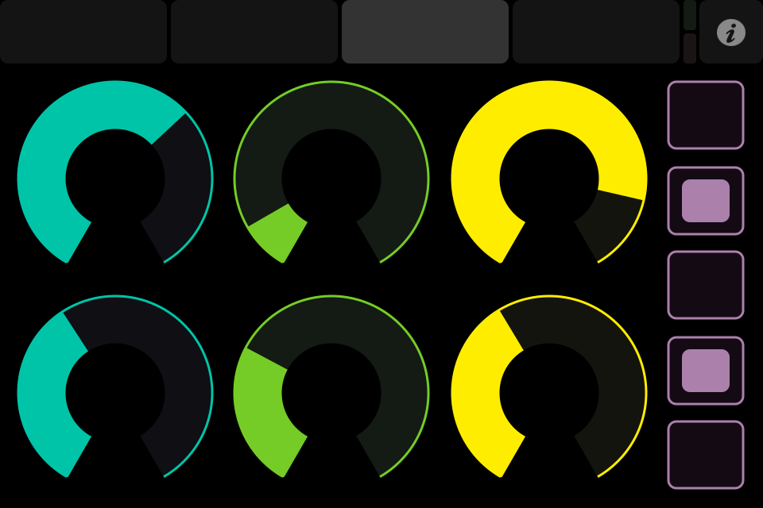

# Paint with Processing and TouchOSC
## Workshop June 2017
====

In this workshop we will be learning how to connect your Processing sketches to TouchOSC iPad app, create custom TouchOSC interfaces, so that you can control multiple parameters in your Processing sketches. Familiarity with processing will definitely help, but isn't necessary.

We will spend 2 hours reviewing setup, and the 3rd hour will be dedicated to working on your sketches and answering questions.

**Resources**

[Download TouchOSC](https://itunes.apple.com/app/touchosc/id288120394)

[Download TouchOSC Editor](https://hexler.net/software/touchosc#downloads)

[Download TouchOSC Bridge](https://hexler.net/software/touchosc#downloads)

[Download Processing](https://processing.org/download/)

### Intro Sketch
Here we can see a quick video that will allow us to get an idea of the type of interaction we can add by connecting controllers beyond the mouse. Once we go beyond the mouse, interacting with the computer becomes almost like a musical experience.

[Example link](https://vimeo.com/59984923)

<!--  -->

###What is TouchOSC?
TouchOSC is an app designed for iOS that gives us the ability to communicate between platforms using Open Sound Control(OSC) or Midi. Also, gives us the ability to connect to our computer remotely so that it is not the main center of focus, the screen is not even needed.

[Download TouchOSC](https://itunes.apple.com/app/touchosc/id288120394)

[Download TouchOSC Editor](https://github.com/matt0rtega/Paint-with-Processing)

[Download TouchOSC Bridge](https://github.com/matt0rtega/Paint-with-Processing)

[Download Processing](https://github.com/matt0rtega/Paint-with-Processing)

###TouchOSC Editor
In the TouchOSC Editor, we can create a customized interface with multiple pages and input types that gives us multiple ways to control behaviors in our sketches.

- Designing using basic inputs
- Moving over to Processing to check connectivity and

###Getting started
TouchOSC communicated via Midi and OSC. OSC requires a Wifi connection and Port setup in order to receive a signal. The easiest way to get setup is by plugging in your iPad/iPhone to your computer and running the TouchOSC Bridge app.
